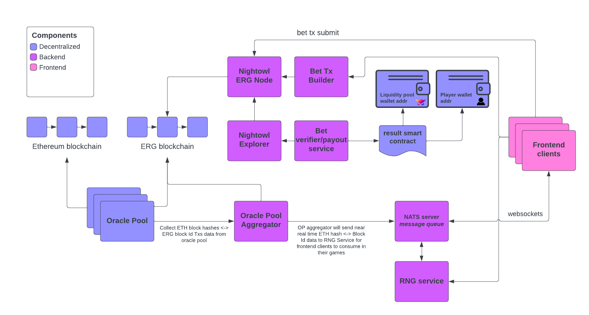

# Nightowl Backend Services

## Nightowl Payout Service

## Nightowl RNG Workflow

### Diagram



### Nightowl oracle scanner

repo url - https://github.com/nightowlcasino/no-oracle-scanner

For the initial v0.1.0 release of Nightowl we'll be obtaining our random numbers from Ethereum block hashes. We will do this by attaching all Nightowl bets, *which are essentially ERG unspent output boxes*, at the time the bet tx was placed to the most recent ETH block hash. Then, we wait until 2 more ETH block hashes are created, take the first 4 bytes of the hash and use that for our random number of those placed bets. Nightowl is constantly rethinking how we'll utilize the bytes from the ETH hash to best fit our game designs. But for the Roulette and coin flip proof of concept games we are using the first 4 bytes for simplicity.

The oracle pool nodes will perform the following API calls to collect and solidify this data,

#### Get latest ETH Block number

```
https://api.etherscan.io/api?module=proxy&action=eth_blockNumber

{
  "jsonrpc": "2.0",
  "id": 83,
  "result": "0xe2c5b1"
}
```

#### Get ETH Block contents by number

```
https://api.etherscan.io/api?module=proxy&action=eth_getBlockByNumber

{
  "jsonrpc": "2.0",
  "id": 1,
  "result": {
    "baseFeePerGas": "0x26ee86a04",
    "difficulty": "0x34a5bbaba686c0",
    "extraData": "0x457468657265756d50504c4e532f326d696e6572735f455537",
    "gasLimit": "0x1c9c380",
    "gasUsed": "0x1c99c4d",
    "hash": "0x5f50653f6ca5c70c3e1d1ea5cdb375ea7184eef1411e8c30cad911f1710191b5",
    "miner": "0x00192fb10df37c9fb26829eb2cc623cd1bf599e8",
    "mixHash": "0xe4a95dd7f815b111fe0b9ab764be152df59eba7a23c0e0c35d7caa71d6762041",
    "nonce": "0x239184a32a4e4ece",
    "number": "0xe2c5b1",
.
.
.
```

#### Get Nightowl unconfirmed bet txs from mempool

```
https://<erg-node>/transactions/unconfirmed

[
  {
    "id": "2eb9d3d36b725b5863d32a93dc6c6e3e9f8bd7e74cc124eb88805734ecf9f064",
    "inputs": [
      {
        "boxId": "3222c8c1edb8c081ccedc0c067abc15a62cc9e8671bddcd01c091e35c7acbbb5",
        "spendingProof": {
          "proofBytes": "4f281b6396fe7bfe1581ea696df1ca4b9cd5ac7fc3acef708c026572f456086a7f08005f67ca260cf269c88eab99de043e499880ce9f7e39",
          "extension": {}
        }
      },
      {
        "boxId": "4542059de39ccd1389c7c8f8b0331755d389250b11b5fa9e32e9c56e462a8e9d",
        "spendingProof": {
          "proofBytes": "f97a4e39a8ba06daf7eab65047249ef22318faa3919bcd71907cde72a8ebb7645fd09cddd96ffefaf385e8cd0164f55ffc547dc950582a39",
          "extension": {}
        }
      }
    ],
    "dataInputs": [
      {
        "boxId": "6a89589c1f8c8507790416f1af18d0754fc7b93f347bec321d1e820b9dcb3bb6"
      }
    ],
    "outputs": [
      {
        "boxId": "82ba0563efda7f6b2c0af7368aeb845f21c02b4fd0f72aa2ac4a8ec955766ae0",
        "value": 1000000,
        "ergoTree": "100504000400050004000e20011d3364de07e5a26f0c4eef0852cddb387039a921b7154ef3cab22c6eda887fd803d601b2a5730000d602e4c6a70407d603b2db6501fe730100ea02d1ededededed93e4c672010407720293e4c67201050ec5720391e4c672010605730293c27201c2a793db63087201db6308a7938cb2db63087203730300017304cd7202",
        "assets": [
          {
            "tokenId": "8c27dd9d8a35aac1e3167d58858c0a8b4059b277da790552e37eba22df9b9035",
            "amount": 1
          }
        ],
        "creationHeight": 759663,
        "additionalRegisters": {
          "R4": "0703082348fd5d0c27d7aa89cd460a58fea2932f12147a04985e500bd9ad64695d58",
          "R5": "0e206a89589c1f8c8507790416f1af18d0754fc7b93f347bec321d1e820b9dcb3bb6",
          "R6": "059cbf9ad103"
        },
        "transactionId": "2eb9d3d36b725b5863d32a93dc6c6e3e9f8bd7e74cc124eb88805734ecf9f064",
        "index": 0
      },
      {
        "boxId": "22d6afaccd64485197072556ade1ea11743e8c6cea7e8b9c3b1dc387d227774b",
        "value": 1100000,
        "ergoTree": "1005040004000e36100204a00b08cd0279be667ef9dcbbac55a06295ce870b07029bfcdb2dce28d959f2815b16f81798ea02d192a39a8cc7a701730073011001020402d19683030193a38cc7b2a57300000193c2b2a57301007473027303830108cdeeac93b1a57304",
        "assets": [],
        "creationHeight": 759663,
        "additionalRegisters": {},
        "transactionId": "2eb9d3d36b725b5863d32a93dc6c6e3e9f8bd7e74cc124eb88805734ecf9f064",
        "index": 1
      },
      {
        "boxId": "bea7b08271d8f36c5bd90d15819544e7305418e7ec513e1da2c7ad67bf79e09e",
        "value": 8890100000,
        "ergoTree": "0008cd03082348fd5d0c27d7aa89cd460a58fea2932f12147a04985e500bd9ad64695d58",
        "assets": [],
        "creationHeight": 759663,
        "additionalRegisters": {},
        "transactionId": "2eb9d3d36b725b5863d32a93dc6c6e3e9f8bd7e74cc124eb88805734ecf9f064",
        "index": 2
      }
    ],
    "size": 630
  },
.
.
.
```

This data is combined in a data structure where the `Hash` field is the Ethereum block hash and the `Boxes` slice are the ERG unspent output box Id bet(s)

```
type CombinedHashes struct {
  Hash  string
  Boxes []string
}

var combinedHashes []CombinedHashes
```

From the above example API calls, the data structure would look like,

```
[
  {
    Hash: "0x5f50653f6ca5c70c3e1d1ea5cdb375ea7184eef1411e8c30cad911f1710191b5"
    Boxes: [
      "82ba0563efda7f6b2c0af7368aeb845f21c02b4fd0f72aa2ac4a8ec955766ae0",
      "22d6afaccd64485197072556ade1ea11743e8c6cea7e8b9c3b1dc387d227774b",
      "bea7b08271d8f36c5bd90d15819544e7305418e7ec513e1da2c7ad67bf79e09e",
    ]
  },
  .
  .
  .
]
```

On a configurable cycle, initially every 7 minutes, we take the combined hashes data structure and transform it into an ERG Tx. It will be sent to an oracle smart contract address and be formatted as seen below,

`R4` will contain the Collection of ETH block hashes

```
"1a" + len(combinedHashes) + 20 + combinedHashes[0].Hash ...
```

```
R4: 1a01205f50653f6ca5c70c3e1d1ea5cdb375ea7184eef1411e8c30cad911f1710191b5
```

`R5` will contain the Collection of ERG Block Ids

```
"0c1a" + len(combinedHashes) + len(combinedHashes[0].Boxes) + "20" + combinedHashes[0].Boxes[0] + "20" + combinedHashes[0].Boxes[1] + "20" + combinedHashes[0].Boxes[2] ...
```

```
R5: 0c1a01032082ba0563efda7f6b2c0af7368aeb845f21c02b4fd0f72aa2ac4a8ec955766ae02022d6afaccd64485197072556ade1ea11743e8c6cea7e8b9c3b1dc387d227774b20bea7b08271d8f36c5bd90d15819544e7305418e7ec513e1da2c7ad67bf79e09e
```

```
{
  "requests": [
    {
      "address": "4FC5xSYb7zfRdUhm6oRmE11P2GJqSMY8UARPbHkmXEq6hTinXq4XNWdJs73BEV44MdmJ49Qo",
      "value": 1500000,
      "assets": [],
      "registers": {
        "R4": "1a01205f50653f6ca5c70c3e1d1ea5cdb375ea7184eef1411e8c30cad911f1710191b5",
        "R5": "0c1a01032082ba0563efda7f6b2c0af7368aeb845f21c02b4fd0f72aa2ac4a8ec955766ae02022d6afaccd64485197072556ade1ea11743e8c6cea7e8b9c3b1dc387d227774b20bea7b08271d8f36c5bd90d15819544e7305418e7ec513e1da2c7ad67bf79e09e"
      }
    }
  ],
  "fee": 1500000,
  "inputsRaw": []
}
```

## RNG service

repo url - https://github.com/nightowlcasino/rng-svc

In order to provide the user with the generated random number before it is officially written to the ERG blockchain we provide the combined hashes data to the user by using the NATS publish/subscribe messaging queue. In this design the oracle scanner will publish every new combined hash data structure to the `eth.hash` subject and the RNG service application will be a subscriber.

The RNG service app will act like a controller and provide an endpoint where it listens to frontend client requests and responds with a random number based on the game that requested it. The workflow will look like the following, if a user is playing roulette and submits a bet, it will get added the data structure as shown above. The RNG service will eventually get ETH hash and ERG bet box id from the NATS message queue. It then gets added to a hash map where the key is the box Id and the value is the random number.

```
type ergBlockRandNum struct {
  mu sync.Mutex
  randNums map[string]string
}

var allErgBlockRandNums ergBlockRandNum
``` 

As the combined hashes come in from the NATS message queue it will continually update the hash map with the available random numbers.

The endpoint the frontend client calls to obtain the random number for a roulette game is,

```
http://<rng-svc>:8089/random-number/roulette?walletAddr=abcdef123&boxId=ghijkl456`
```

After the rng-svc receives the requests it may not have the random number ready to return yet, so it spins up a new thread (go routine) that continually checks the allErgBlockRandNums hash map until a random number is available to return. Because the random number is not known in a predictable timeframe, we use the NATS message queue and websockets as the way for the frontend to get them.

When the client plays their first game it automatically subscribes to the NATS server using the subject name,

```
<game name>.<wallet addr>
```

Because the client is sending their wallet address and game name to the endpoint URL mentioned above, the rng-svc is able to return the random number as it comes in for each individual game and user by publishing it to the same NATS subject the client is subscribed to.

## Bet verifier/payout service

repo url - https://github.com/nightowlcasino/rng-svc

After a bet has officially been added to the ERG blockchain anyone would be able to execute the result smart contract which pays out to the winner of nightowls bet(s). A winner is either the house liquidity pool or the players wallet. The game result smart contract can be found [here](https://github.com/nightowlcasino/ergoscript-contracts/blob/main/roulette/result-contract.md#box-schema-for-spending).

The process for which the bet verifier/payout service works is,

1.) Get ETH & ERG combined hashes Txs from the oracle address `4FC5xSYb7zfRdUhm6oRmE11P2GJqSMY8UARPbHkmXEq6hTinXq4XNWdJs73BEV44MdmJ49Qo` using the API endpoint

```
https://api.ergoplatform.com/api/v1/addresses/4FC5xSYb7zfRdUhm6oRmE11P2GJqSMY8UARPbHkmXEq6hTinXq4XNWdJs73BEV44MdmJ49Qo/transactions
```

2.) Loop through all the ERG Box Ids from the `R5` register of the oracle tx(s) and check what game the bet was made for and whether the house or player won the bet based on the random number from the `R4` register value. The smart contract is designed to only return `TRUE` if the real winner is trying to claim the funds. One should only be able to claim their funds 1 time.

### Anatomy of the ERG result smart contract tx
<br>

**wallet address of winner**
```
"address": "0e240008cd03f41826ee2829c96330ade4635cf10a68cd2f362efa29ef6b0544e0f24bcf2d08",
```

This will either be the wallet address of the player which we save in the `R6` register of the bet tx or the address of liquidity pool

**winning funds**
```
"assets": [
  {
    // OWL token ID
    "tokenId": "afd0d6cb61e86d15f2a0adc1e7e23df532ba3ff35f8ba88bed16729cae933032",
    // Equalled to the bet amount * bet multiplier
    "amount": 20
  }
],
```

**location of nightowl bet box id within oracle tx**  

for an oracle scanner tx with `R5` equalled to
```
[
  [],
  [],
  [],
  [],
  [],
  [248ce4ecf33025d6aef31ab13cacef120c46495f4fcd054766293835bf959919],
  [],
  [],
  [],
  [],
  [],
  [],
  []
]
```

```
"registers": {
  // index 5 for outer array
  "R4": "040a",
  // index 0 for inner array
  "R5": "0400"
}
```

**serialized value of the nightowl bet box**
```
"inputsRaw": [
  "e0c65b1012040004000404054a0e203eff84aa4780a9cc612ed429b28c0cb2d17d5d6372a84c4050e68d234743042b0e20afd0d6cb61e86d15f2a0adc1e7e23df532ba3ff35f8ba88bed16729cae9330320400040205040404050f05120406050604080509050c040ad807d601b2a5730000d602b2db63087201730100d603e4c6a70404d6049e7cdb6801b2db6502fe9999a38cc7a7017302007303d6057ee4c6a7050405d6069972057204d607cb7304d1ed96830201938c7202017305938c7202028cb2db6308a7730600029597830501ed9372037307939e720473087205eded9372037309927206730a907206730bed937203730c939e7204730d7205eded937203730e927206730f9072067310ed9372037311937205720493c27201720793c272017207e9a42e01afd0d6cb61e86d15f2a0adc1e7e23df532ba3ff35f8ba88bed16729cae9330321403040204000e240008cd03f41826ee2829c96330ade4635cf10a68cd2f362efa29ef6b0544e0f24bcf2d085fb5b3a891e1f9cb0e327dc0af6fd95c30d7aa7ff1f0f76a4e43c09cf476744d02"
],
```

**serialized value of the oracle scanner tx**
```
"dataInputsRaw": [
  "e0c65b100208cd02483965d64c5b5aeb3b6bb03d0ae4b7904be4f905d020ecb305040d8f660211fb0402ea027300d191a37301e9a42e00021a0d2090a7d8a3610ca41ff7693974ffc44d7c9e079933afd8ccd582844e4af47a85b0204a100475d187633dd83075acd7a758bd8af8b8de284a9723b5f51c6defa11cf7205590c95c86b829fa953c0e6913da4d81adf88417fd0593e2cc1bfd690193cdc52085a6d30da9587581502683db52e06a7984a37724fb576fd1836e4db5fb653db120836243e33110c351ab2949f69ce9380d413cd4d67622d64c6dc1110cd1b57db720bcd6939c8af62bc73f3c0eec2a9b793d48a4b696f26a5817d83508fa0caeb51d20040fc314da9d97577276f2187a3ef4b555eb05942064f64c5f787b0d06400e7f20cdfbb4ec7cc16cc7e1b946f6cabb56e3497247dbeb01e5ee733ef053c1bbe63e20d37e2f75f2f45a8325d79c7e952a0508618d2b07d8bf602ba48724bc1a1f75902014712153022b813f17b6e37962fbf72e250d7fe7976cc8968602649fa27f526a201fb438d4b3460453bf80d3c340de73209a467aa2ef62637044d598634f637a4e20136e77e920d5fec6270d3443069b4d00b3bc7ca562a229d1f520b9713bcca67d2070e3491c7482b95855acefa93ace0b8a571f50509b7d780c6dbb095e5aff94030c1a0d00000000000120248ce4ecf33025d6aef31ab13cacef120c46495f4fcd054766293835bf95991900000000000000a1239cf167fddaf00b1315e48592ee349a62d9558c93408a2a18620e54bedbfc00"
]
```

#### Example ERG result smart contract tx

```
{
  "requests": [
    {
      "address": "0e240008cd03f41826ee2829c96330ade4635cf10a68cd2f362efa29ef6b0544e0f24bcf2d08",
      "value": 500000,
      "assets": [
        {
          "tokenId": "afd0d6cb61e86d15f2a0adc1e7e23df532ba3ff35f8ba88bed16729cae933032",
          "amount": 20
        }
      ],
      "registers": {
        "R4": "040a",
        "R5": "0400"
      }
    }
  ],
  "fee": 1000000,
  "inputsRaw": [
    "e0c65b1012040004000404054a0e203eff84aa4780a9cc612ed429b28c0cb2d17d5d6372a84c4050e68d234743042b0e20afd0d6cb61e86d15f2a0adc1e7e23df532ba3ff35f8ba88bed16729cae9330320400040205040404050f05120406050604080509050c040ad807d601b2a5730000d602b2db63087201730100d603e4c6a70404d6049e7cdb6801b2db6502fe9999a38cc7a7017302007303d6057ee4c6a7050405d6069972057204d607cb7304d1ed96830201938c7202017305938c7202028cb2db6308a7730600029597830501ed9372037307939e720473087205eded9372037309927206730a907206730bed937203730c939e7204730d7205eded937203730e927206730f9072067310ed9372037311937205720493c27201720793c272017207e9a42e01afd0d6cb61e86d15f2a0adc1e7e23df532ba3ff35f8ba88bed16729cae9330321403040204000e240008cd03f41826ee2829c96330ade4635cf10a68cd2f362efa29ef6b0544e0f24bcf2d085fb5b3a891e1f9cb0e327dc0af6fd95c30d7aa7ff1f0f76a4e43c09cf476744d02"
  ],
  "dataInputsRaw": [
    "e0c65b100208cd02483965d64c5b5aeb3b6bb03d0ae4b7904be4f905d020ecb305040d8f660211fb0402ea027300d191a37301e9a42e00021a0d2090a7d8a3610ca41ff7693974ffc44d7c9e079933afd8ccd582844e4af47a85b0204a100475d187633dd83075acd7a758bd8af8b8de284a9723b5f51c6defa11cf7205590c95c86b829fa953c0e6913da4d81adf88417fd0593e2cc1bfd690193cdc52085a6d30da9587581502683db52e06a7984a37724fb576fd1836e4db5fb653db120836243e33110c351ab2949f69ce9380d413cd4d67622d64c6dc1110cd1b57db720bcd6939c8af62bc73f3c0eec2a9b793d48a4b696f26a5817d83508fa0caeb51d20040fc314da9d97577276f2187a3ef4b555eb05942064f64c5f787b0d06400e7f20cdfbb4ec7cc16cc7e1b946f6cabb56e3497247dbeb01e5ee733ef053c1bbe63e20d37e2f75f2f45a8325d79c7e952a0508618d2b07d8bf602ba48724bc1a1f75902014712153022b813f17b6e37962fbf72e250d7fe7976cc8968602649fa27f526a201fb438d4b3460453bf80d3c340de73209a467aa2ef62637044d598634f637a4e20136e77e920d5fec6270d3443069b4d00b3bc7ca562a229d1f520b9713bcca67d2070e3491c7482b95855acefa93ace0b8a571f50509b7d780c6dbb095e5aff94030c1a0d00000000000120248ce4ecf33025d6aef31ab13cacef120c46495f4fcd054766293835bf95991900000000000000a1239cf167fddaf00b1315e48592ee349a62d9558c93408a2a18620e54bedbfc00"
  ]
}
```
